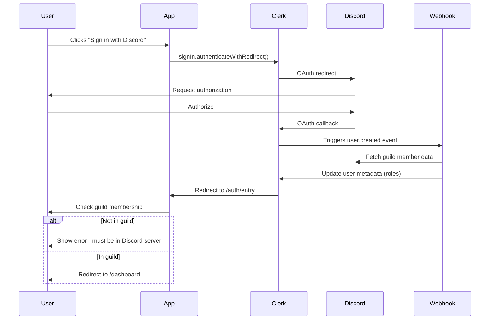
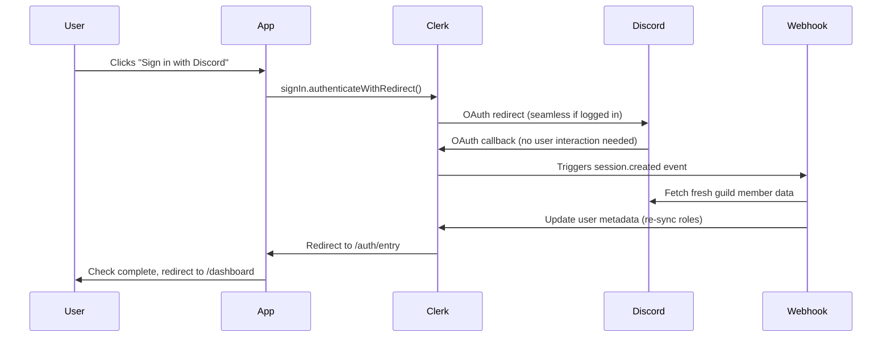

# Authentication Flow Documentation

This document explains the restructured Clerk + Discord authentication flow for the Brackeys Community web application.

## Overview

The authentication system uses **Clerk** for user management and **Discord OAuth** for identity verification and role-based access control. The flow ensures that only members of the Brackeys Discord server can access the application, and their roles are synced on every login.

## Key Components

### 1. ClerkAuthProvider (`src/context/ClerkAuthProvider.tsx`)

- Manages authentication state using React Context
- Provides `signInWithDiscord()` and `signOut()` methods
- Syncs user data from Clerk to local state
- Extracts Discord guild membership and Hasura claims from Clerk metadata

### 2. AuthEntry Page (`src/pages/AuthEntry.tsx`)

- **Route:** `/auth/entry`
- Handles post-OAuth processing
- Checks Discord guild membership from Clerk metadata
- Validates user has Discord account linked
- Redirects to dashboard when authentication is complete

### 3. Login Page (`src/pages/Login.tsx`)

- Primary authentication interface
- Discord OAuth only - simple and secure
- Explains Discord requirement and benefits

### 4. Clerk Webhook (`src/routes/api/webhooks/clerk.tsx`)

- Syncs Discord roles on `user.created` and `session.created` events
- Fetches guild member data via Discord API
- Fetches user's Discord guild member data via Discord API
- Updates Clerk user metadata with:
  - Discord roles
  - Guild membership status
  - Hasura role claims (admin, staff, moderator, brackeys, user)

## Authentication Flows

### First-Time User Sign-Up



**Steps:**

1. User clicks "Sign in with Discord" button on `/login`
2. `signInWithDiscord()` triggers Clerk OAuth flow
3. User is redirected to Discord for authorization
4. Discord redirects back to Clerk's callback handler
5. Clerk processes OAuth and creates/updates user account
6. **Webhook fires** on `user.created` to sync Discord roles
7. Clerk redirects to `/auth/entry`
8. App checks Discord guild membership from metadata
9. If user is in guild → redirect to `/dashboard`
10. If user is not in guild → show error message

**Key Benefits:** Simple, secure authentication flow using only Discord OAuth. No additional email verification needed.

### Returning User Login (Discord OAuth)



**Key Points:**

- If user is already logged into Discord in their browser, the OAuth flow is **seamless** (no interaction required)
- **Webhook fires** on `session.created` to re-sync Discord roles on every login
- User is immediately redirected to dashboard after guild check

## Role Syncing

### How It Works

1. **On Every Login:** When a user signs in via Discord OAuth, Clerk fires a `session.created` webhook event
2. **Webhook Handler:** The webhook fetches the user's Discord OAuth token from Clerk
3. **Discord API Call:** Using the token, it fetches fresh guild member data from Discord
4. **Role Mapping:** Discord roles are mapped to Hasura roles:
   - `451380371284557824` → `admin`
   - `756285704061059213` → `staff`
   - `756178968901582859` → `moderator`
   - `491536338525356042` → `brackeys`
   - Default → `user`
5. **Metadata Update:** Clerk user metadata is updated with current roles

### Important Notes

- Roles are **always synced on login**, even for returning users
- OAuth tokens may expire; if expired, role sync will fail (logged as error)
- Users not in the Brackeys Discord server will have `inGuild: false` in metadata
- The `/auth/entry` page checks `inGuild` and shows an error if false

## Configuration

### Environment Variables

**Frontend (`.env`):**

```env
VITE_CLERK_PUBLISHABLE_KEY=pk_test_...
```

**Backend (`api/.env` or Vercel Environment Variables):**

```env
CLERK_WEBHOOK_SECRET=whsec_...
DISCORD_GUILD_ID=240491168985399296
```

### Clerk Dashboard Setup

1. **Enable Discord OAuth:**
   - Navigate to: User & Authentication → Social Connections
   - Enable Discord
   - For production, add custom Discord OAuth credentials

2. **Configure Webhooks:**
   - Navigate to: Webhooks
   - Add endpoint: `https://your-domain.com/api/webhooks/clerk`
   - Subscribe to events: `user.created`, `session.created`
   - Copy webhook secret to environment variables

3. **Configure Redirect URLs:**
   - Ensure `/auth/entry` is in allowed redirect URLs

## User Experience

### All Users

- **Discord OAuth only** - simple and secure
- Guild membership validated on first sign-up
- Roles automatically re-synced on every login via webhook
- Seamless experience if already logged into Discord in browser

### Security Features

- Discord guild membership validated on first sign-up
- Roles re-evaluated on every login via webhook
- Users not in guild cannot access the application
- OAuth tokens securely managed by Clerk

## Troubleshooting

### "Discord account not connected" Error

- User tried to access `/auth/entry` without going through Discord OAuth
- Solution: Redirect to `/login` and use Discord authentication

### "Must be a member of the Brackeys Discord server" Error

- User is not in the Discord guild (ID: 240491168985399296)
- Solution: User must join the Brackeys Discord server first

### Roles Not Syncing

- Check webhook logs in Vercel
- Verify Discord OAuth token is valid
- Check Discord API rate limits
- Ensure webhook secret is correct

## Future Improvements

1. **Token Refresh:** Implement Discord token refresh to keep roles in sync even if OAuth token expires
2. **Manual Role Sync:** Add a "Refresh Roles" button in user profile
3. **Multi-Guild Support:** Support multiple Discord servers if needed
4. **Role-Based UI:** Show different UI elements based on user roles
5. **Cached Role Data:** Cache Discord API responses to reduce API calls

## Code References

- **Auth Provider:** `src/context/ClerkAuthProvider.tsx`
- **Auth Entry:** `src/pages/AuthEntry.tsx`
- **Login Page:** `src/pages/Login.tsx`
- **Login Button:** `src/components/auth/LoginButton.tsx`
- **Webhook Handler:** `src/routes/api/webhooks/clerk.tsx`
- **Discord Sync API:** `src/routes/api/auth/sync-discord.tsx`
- **Discord Sync Hook:** `src/hooks/useDiscordSync.ts`
- **Auth Context Types:** `src/context/authContext.ts`
- **Router Configuration:** `src/router.ts`
